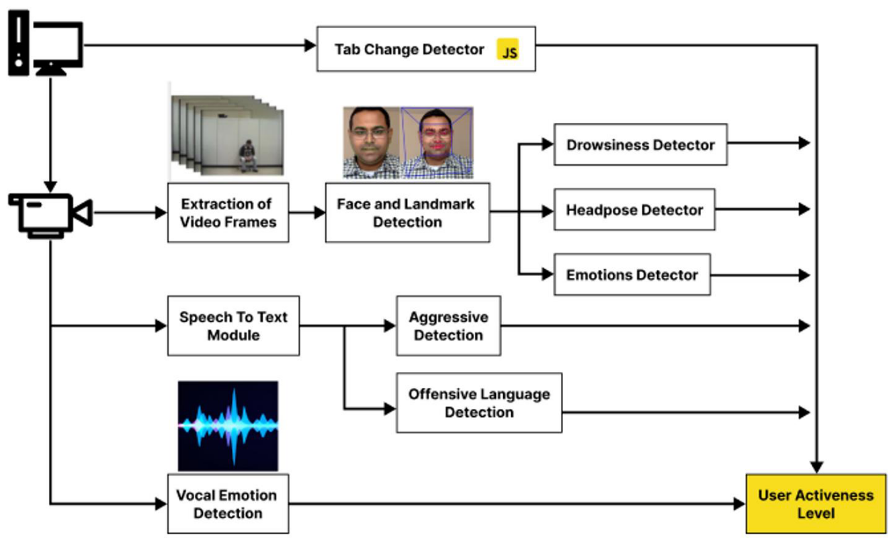
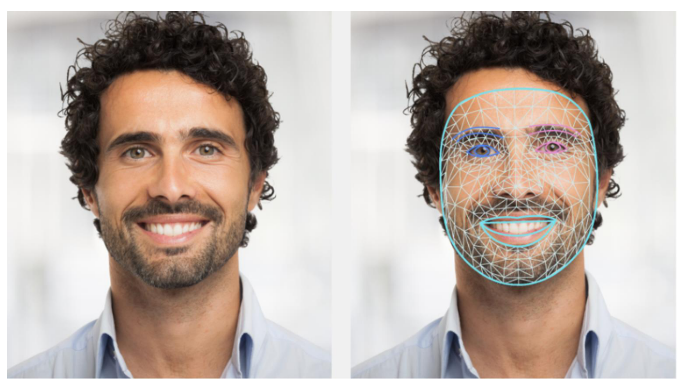
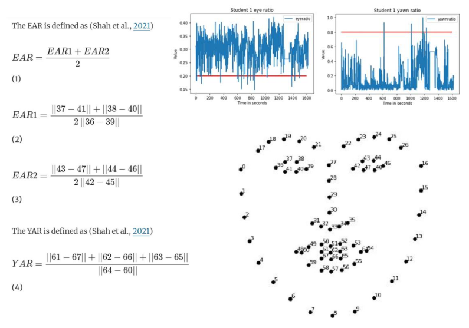
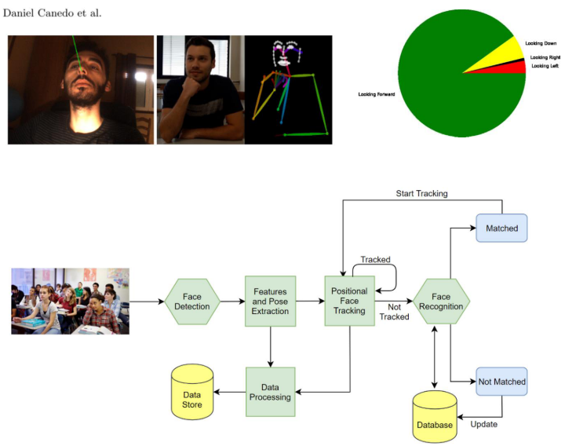
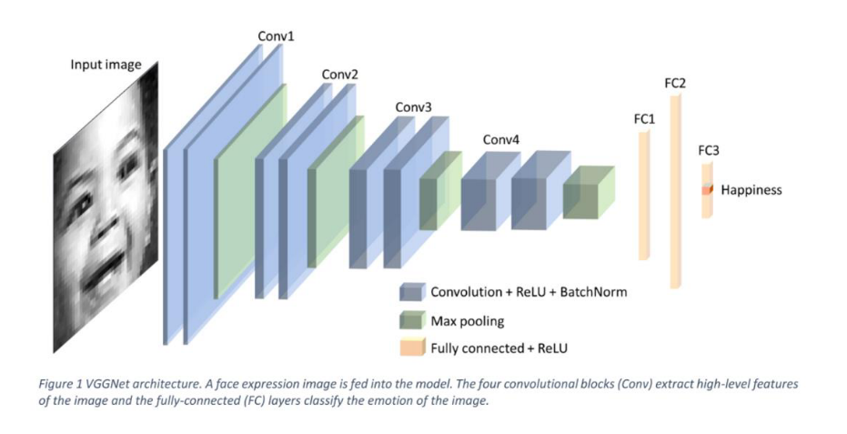
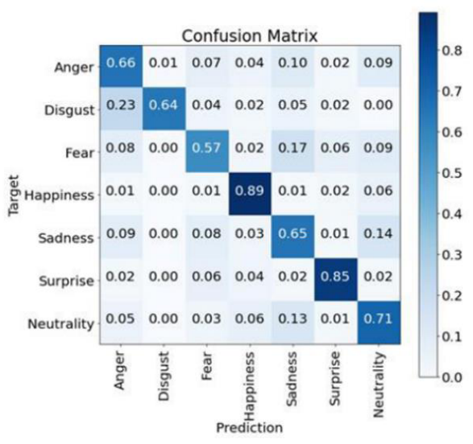
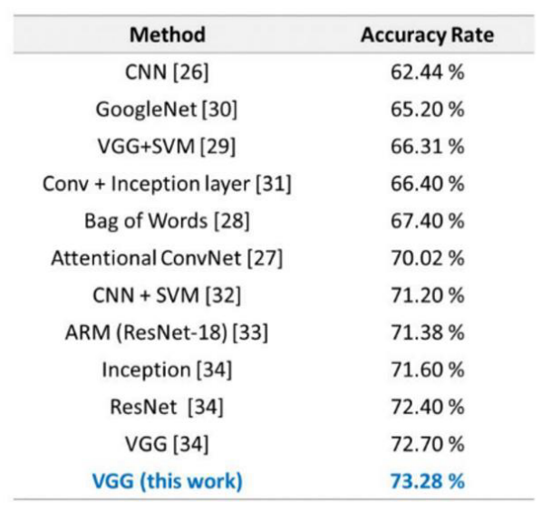
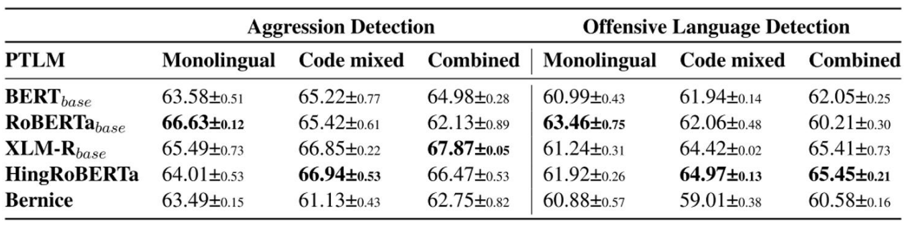
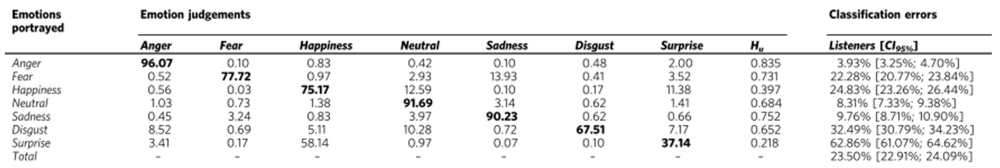
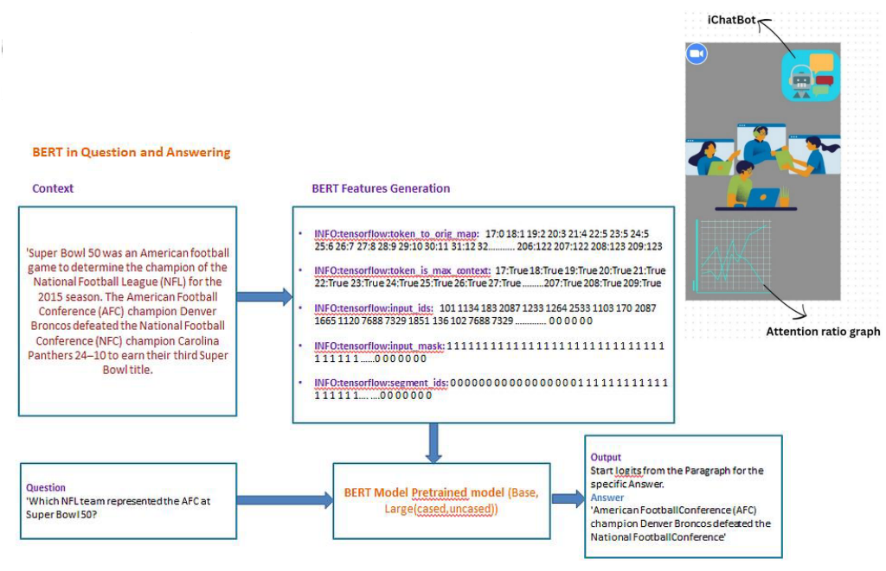

# Focus Meter

## Problem Statement

Develop an educational aid that supports students with diverse learning needs (dylexia, ADHD, etc.) to enhance their learning experiences and academic achievements in classrooms.

## Flow Diagram

## Attention Monitoring

### Face and Landmark Detection

MediaPipe Solutions provides a suite of libraries and tools for you to quickly apply artificial intelligence (AI) and machine learning (ML) techniques in your applications. You can plug these solutions into your applications immediately, customize them to your needs, and use them across multiple development platforms. MediaPipe Solutions is part of the MediaPipe open source project, so you can further customize the solutions code to meet your application needs.

**References**  
https://github.com/google/mediapipe https://developers.google.com/mediapipe

### Drowsiness Detection

The first step in the drowsiness detector is detecting the face, where a 68-point structure is distributed among the recognized key points in a human face. Then the drowsiness of the student will be calculated using the eye aspect ratio (EAR) and the yawn aspect ratio (YAR) (Shah et al., 2021). Figure 2 shows the presentation of the 68 facial landmarks (Pinzon-Gonzalez & Barba-Guaman, 2022). EAR and YAR are calculated by Eq. 1 and Eq. 4 for drowsiness detection. The videos will be processed using the OpenCV library (Howse, 2013). For each frame, the EAR and the YAR are extracted. Hence the EAR and YAR are calculated for each second for each student. A threshold for the EAR indicates when the eyes are closed, indicated as sleeping (Shah et al., 2021). A threshold for YAR indicates when the mouth is opened widely, indicated as yawning (Shah et al., 2021). The drowsiness detector generates the first two inputs that we have for our ML model

**References**  
https://www.semanticscholar.org/paper/Assessment-of-Student-Attentiveness-toE-Learning-Shah-Meenakshi/effba10a9dcec165e201fd55c77a6799e4f1daed

### Headpose Detector

The head pose can help show the student's distraction or attentiveness (Pinzon-Gonzalez & Barba-Guaman, 2022). When a student is distracted, they may start looking here and there (Shah et al., 2021). Hence, the head's position may help recognize students' attentiveness and assist in training the ML model. First, a face mesh is built to identify the face and its six key points. Then the rotation angle is calculated. The X and Y components of the rotation angle are determined using the OpenCV library (Howse, 2013). For each frame, the two components of the rotation angle are extracted. Hence the two components of the rotation angle are calculated for each second for each student generating two more inputs for our ML model.
We propose the use of the MTCNN. This block is responsible to feed the Features and Pose Extraction block with images of the students’ faces, which has the role of retrieving their facial features and body pose. We propose the adjustment of the head pose estimation, the head orientation and the use of OpenPose for the body pose

**References**  
_Pinzon-Gonzalez, J. G., & Barba-Guaman, L. (2022). Use of Head Position Estimation for Attention Level Detection in Remote Classrooms. In Proceedings of the Future Technologies Conference (FTC) 2021 1, 275–293. Springer International Publishing._

### Emotions Detector

Several authors have requested combining emotions with other measurement forms to assess student attentiveness (Revadekar et al., 2020; Shah et al., 2021), as facial expressions are one of the most potent signals for human beings to transfer their emotional states (Li & Deng, 2020). Facial expression recognition (FER) has been used in various study types, including driver fatigue surveillance, student attentiveness, and medical treatment (Khaireddin & Chen, 2021; Li & Deng, 2020). FER has been used to encode expression representation from facial representations. One of the famously used datasets for FER is FER 2013(Goodfellow et al., 2013; Khaireddin & Chen, 2021; Li & Deng, 2020). FER2013 is considered a benchmark in comparing performance for emotion recognition (Khaireddin & Chen, 2021). In (Khaireddin & Chen, 2021), the authors used convolution neural networks (CNN) where they adopted VGGNet architecture. Khaireddin & Chen fine-tuned the hyperparameters and experimented with various optimization methods for the VGGNet, where their model achieved an accuracy of 73.28% on FER2013 without extra training data. The VGGNet consists of four convolutional stages and three fully connected layers.

**References**  
Khaireddin, Y., & Chen, Z. (2021). Facial emotion recognition: State of the art performance on FER2013. arXiv preprint arXiv:2105.03588

### Aggressive & Offensive Language Detection

We found that the results obtained via fine-tuning pretrained language models in this section. Table 4 reports the test set macro F1-scores from pretrained language models for the two tasks of aggression detection and offensive language detection on our dataset. In addition to this, we also present the scores on English monolingual and Hindi-English code-mixed subsets of our dataset. For aggression, we observe that XLM-Rbase outperforms other pre-trained language models on our overall dataset, achieving the highest macro F1score of 67.87. On the English subset, we observe that RoBERTabase performs better than other models with a macro F1-score of 66.63, whereas for the Hindi-English code-mixed subset, Hing-RoBERTa gives the best macro F1-score of 66.94. For offensive language detection, we observe that Hing-RoBERTa outperforms other pre-trained language models on our overall dataset, achieving the highest macro F1-score of 65.45. On the English subset, we observe that RoBERTabase outperforms other models with a macro F1-score of 63.46. For the Hindi-English code-mixed subset, Hing-RoBERTa once again gives the best performance with a macro F1-score of 64.97.

**References**  
_Towards Safer Communities: Detecting Aggression and Offensive Language in Code-Mixed Tweets to Combat Cyberbullying Nazia Nafis, Diptesh Kanojia, Naveen Saini, Rudra Murthy, Indian Institute of Information Technology Lucknow, India._

### Vocal Emotion Detection using Multilayer Perceptron

Vocal emotion detection using Multilayer Perceptron (MLP) neural networks has proven to be a powerful and effective approach to understanding and classifying emotions in spoken language. With the availability of large annotated datasets and advancements in deep learning techniques, MLP-based models continue to improve the accuracy and robustness of vocal emotion detection systems, contributing to enhanced human-computer interaction and emotional analysis applications.

**References**  
_Lausen, A., Hammerschmidt, K. Emotion recognition and confidence ratings predicted by vocal stimulus type and prosodic parameters. Humanit Soc Sci Commun 7, 2 (2020)._
https://doi.org/10.1057/s41599-0200499-z

## Continuous Assistant via Intelligent Chatbot

### BERT-based Cross-Lingual Question Answering Chatbot

iChatBot tries to ask questions during breaktime from the users to check their attentiveness during the class. The questions are self generated by the chatbot by listening to the question during class hours.

The Intelligent Chatbot (iChatbot) utilizes Natural Language Processing (NLP)
for
conversation, Information Retrieval to fetch internet data on the current topic, Machine Learning for cross-questioning to assess comprehension, and potentially Web Scraping and API Integration to access and provide up-to-date information from the web page link given by the host that allow the student/ one in the meeting to use it as browser without exiting the tab and grab more information on ongoing topic. And also create polls and crossquestion in online meet to make it more effective as offline meets .

**References**  
https://medium.datadriveninvestor.com/extendinggoogle-bert-as-question-and-answering-model-andchatbot-e3e7b47b721a
